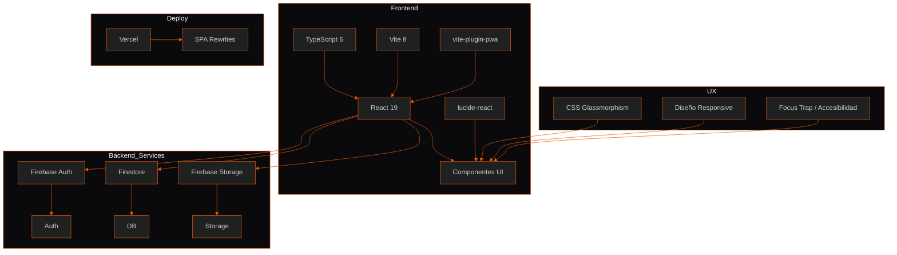
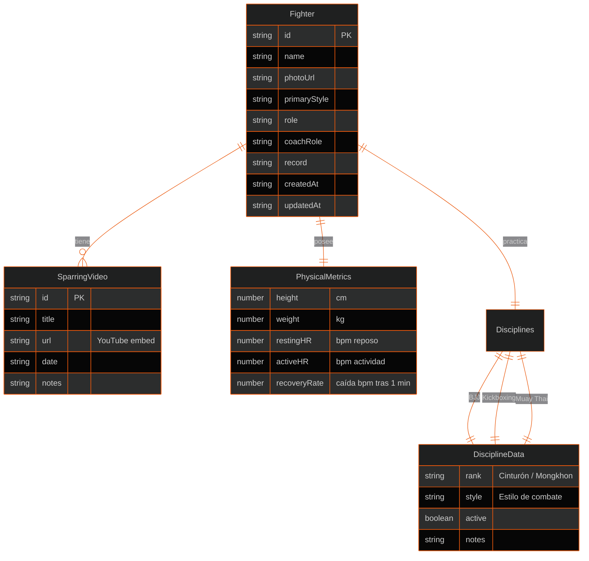

# 🥋 Guerreros de Dios MMA — Plataforma de Control de Rendimiento

> **Alianza de Artes Marciales Mixtas** — Santiago de Cali, Colombia

---

## 📋 Resumen

Plataforma web **Progressive Web App (PWA)** para la gestión integral de un club/alianza de MMA. Permite administrar atletas con perfiles técnicos por disciplina (BJJ, Kickboxing, Muay Thai), registrar combates con video, calcular métricas físicas (IMC, frecuencia cardíaca), y gestionar contenido institucional como tutoriales, horarios, tienda y sub-clubes.

| Dato | Valor |
|---|---|
| **Propósito** | Dashboard de rendimiento físico y gestión de atletas |
| **Cliente** | Alianza "Guerreros de Dios MMA" |
| **Ubicación** | Cali, Colombia |
| **Fundación** | 2018 |
| **Idioma UI** | Español (voseo rioplatense) |
| **Rol** | Full-stack frontend + Firebase + PWA |

---

## 🛠 Tech Stack



| Capa | Tecnología | Versión |
|---|---|---|
| **Lenguaje** | TypeScript | ~6.0.2 |
| **UI** | React | ^19.2.6 |
| **Bundler** | Vite | ^8.0.12 |
| **Backend/Database** | Firebase (Firestore + Auth + Storage) | ^12.15.0 |
| **PWA** | vite-plugin-pwa + Workbox | ^1.3.0 |
| **Iconos** | lucide-react | ^1.21.0 |
| **Estilos** | CSS puro — Glassmorphism, Dark Theme | — |
| **Deploy** | Vercel | — |
| **Linting** | ESLint 10 + typescript-eslint | ^10.3.0 |

---

## 🏗 Arquitectura

```mermaid
%%{init: {'theme': 'dark', 'themeVariables': {
  'primaryColor': '#0a0a0c',
  'primaryTextColor': '#f8fafc',
  'primaryBorderColor': '#ea580c',
  'lineColor': '#ea580c',
  'secondaryColor': '#121216',
  'tertiaryColor': '#16161c',
  'clusterBkg': '#0a0a0c',
  'clusterBorder': '#ea580c',
  'nodeBorder': '#ea580c',
  'nodeTextColor': '#f8fafc',
  'nodeBkg': '#16161c',
  'edgeLabelBackground': '#16161c'
}}}%%
graph TB
    subgraph App["App (State Container)"]
        direction LR
        CP[currentPage]
        F[fighters[]]
        SF[selectedFighter]
    end

    subgraph Providers["Context Providers"]
        AUTH[AuthProvider<br/>user / isAdmin / isEditor]
        TOAST[ToastProvider<br/>notificaciones]
        CONFIRM[ConfirmProvider<br/>diálogos Promise-based]
    end

    subgraph Pages["Páginas (React.lazy + Suspense)"]
        D[Dashboard]
        FL[Atletas<br/>FighterList + FighterProfile]
        TUT[Tutoriales]
        SUB[Alianzas / SubClubs]
        SH[Tienda]
        CI[Info Club]
    end

    subgraph Firebase["Firebase Services"]
        FS2[Firestore<br/>fighters collection]
        FA2[Firebase Auth<br/>Google OAuth]
    end

    subgraph PWA_Layer["PWA Layer"]
        SW[Service Worker<br/>Workbox]
        CACHE[Cache Unsplash<br/>CacheFirst]
        MAN[Manifest<br/>standalone / portrait]
    end

    App --> Pages
    Providers --> Pages
    Firebase --> |onSnapshot<br/>tiempo real| App
    PWA_Layer --> App
```

### 📐 Patrones y Decisiones Técnicas

| Patrón | Implementación |
|---|---|
| **SPA sin Router** | Estado `currentPage` + renderizado condicional en `App.tsx` |
| **Provider Pattern** | 3 contextos anidados: Auth > Toast > Confirm |
| **Lazy Loading** | `React.lazy()` + `Suspense` para todas las páginas |
| **Error Boundary** | `ErrorBoundary` por sección, no uno global |
| **Real-time Sync** | `onSnapshot` de Firestore para actualización instantánea |
| **Promise-based Confirm** | `confirm()` devuelve `Promise<boolean>`, resuelve con true/false |
| **Offline-ready** | Service Worker con Workbox, runtime cache de imágenes |
| **Custom SVG** | Cinturones y Mongkhons renderizados con SVGs programáticos |

---

## ✨ Funcionalidades

### 🏃 Gestión de Atletas

- **CRUD completo** — Registrar, editar, eliminar peleadores con foto comprimida (Canvas a 300px)
- **Perfil multidisciplina** — Rango/cinturón por BJJ, Kickboxing y Muay Thai con visual SVG
- **Métricas físicas** — Altura, peso, IMC (automático con categoría y color), frecuencia cardíaca en reposo/actividad, tasa de recuperación
- **Sparrings** — Registro audiovisual con videos embedidos de YouTube, fecha, título y notas
- **Búsqueda y filtros** — Por nombre, estilo primario y disciplina activa



### 🔐 Autenticación y Roles

```mermaid
%%{init: {'theme': 'dark', 'themeVariables': {
  'primaryColor': '#0a0a0c', 'primaryTextColor': '#f8fafc',
  'primaryBorderColor': '#ea580c', 'lineColor': '#ea580c',
  'secondaryColor': '#121216', 'tertiaryColor': '#16161c',
  'nodeBorder': '#ea580c', 'nodeTextColor': '#f8fafc',
  'nodeBkg': '#16161c', 'edgeLabelBackground': '#16161c'
}}}%%
graph LR
    A[Visitante] -->|Solo lectura| V[Ver atletas<br/>Ver tutoriales<br/>Ver tienda]
    B[Google OAuth] -->|email admin| ADMIN[Admin<br/>juan939srz@gmail.com]
    C[Admin Key<br/>VITE_ADMIN_KEY] -->|clave válida| EDITOR[Editor<br/>Crear/Editar/Eliminar]
    ADMIN --> EDITOR
```

- **Google OAuth** via Firebase Authentication
- **Admin Key alternativa** para acceso sin cuenta Google
- Dos niveles: `isAdmin` (hardcodeado por email) e `isEditor` (admin + key auth)
- Visitantes en modo **solo lectura**

### 📊 Dashboard

Widgets en grid responsive con glass-panel:

| Widget | Descripción |
|---|---|
| **Atletas** | Top 4 peleadores con cards |
| **Horario semanal** | Lunes a domingo con logos de disciplina |
| **Sub-clubes** | Alianzas activas |
| **Tutoriales** | Top 3 videos destacados |
| **Info Club** | Dirección, teléfono, email, redes |
| **Alertas/Eventos** | Próximos eventos y avisos |

### 📱 Progressive Web App

| Característica | Detalle |
|---|---|
| **Service Worker** | Auto-update con Workbox |
| **Runtime Caching** | Imágenes Unsplash (CacheFirst, 50 imágenes, 30 días) |
| **Manifest** | standalone, portrait-primary, theme #0a0a0c |
| **iOS Meta** | apple-mobile-web-app, black-translucent status bar |
| **Safe Areas** | `env(safe-area-inset-bottom)` para notches |

### 🎨 UI / UX

- **Tema oscuro** con gradiente radial (`#170f11` a `#060608`)
- **Glassmorphism** — `backdrop-filter: blur(12px)` en paneles
- **Tipografía** — Outfit (títulos) + Plus Jakarta Sans (cuerpo)
- **Animaciones** — Shimmer loading, slide-in toasts, hover transitions
- **Responsive** — Topbar desktop → mobile slim + bottom nav en <900px
- **Skeleton loading** — Estados de carga esqueletales
- **Accesibilidad** — Focus trap en modales, roles ARIA

---

## 📁 Estructura del Código

```
src/
├── components/        # 16 componentes React (Dashboard, FighterProfile, etc.)
├── contexts/          # 3 contextos (Auth, Toast, Confirm)
├── hooks/             # useFocusTrap
├── services/          # Firebase init, CRUD Firestore, club data
├── types/             # TypeScript interfaces del dominio MMA
├── utils/             # belts.ts, compressImage.ts
└── assets/Logos/      # Logos del club (BJJ, Kickboxing, Muay Thai)
```

---

## ⚙️ Cómo correr localmente

```bash
# 1. Clonar e instalar
git clone <repo>
cd mmappantigravity-version
npm install

# 2. Configurar Firebase (.env)
VITE_FIREBASE_API_KEY=...
VITE_FIREBASE_AUTH_DOMAIN=...
VITE_FIREBASE_PROJECT_ID=...
VITE_FIREBASE_STORAGE_BUCKET=...
VITE_FIREBASE_MESSAGING_SENDER_ID=...
VITE_FIREBASE_APP_ID=...
VITE_ADMIN_KEY=...

# 3. Desarrollo
npm run dev       # → http://localhost:5173

# 4. Build producción
npm run build     # → dist/
```

### Scripts disponibles

| Script | Comando |
|---|---|
| `dev` | `vite` (servidor 0.0.0.0:5173) |
| `build` | `tsc -b && vite build` |
| `lint` | `eslint .` |
| `preview` | `vite preview` |

---

## 🔒 Seguridad

- **Firestore Rules** — Lectura pública, escritura solo email admin
- **Storage Rules** — Misma política, restringido a `fighters/{fighterId}/{fileName}`
- **Variables de entorno** — Toda la configuración Firebase via `.env`
- **Admin Key** — Validada client-side con clave desde variable de entorno

---

## 📦 Deploy

Configurado para **Vercel** con `vercel.json` para SPA rewrites:

```json
{
  "rewrites": [{ "source": "/(.*)", "destination": "/index.html" }]
}
```

---

## 🧠 Highlights Técnicos

1. **TypeScript 6 + Vite 8** — Stack cutting-edge con `erasableSyntaxOnly`
2. **Sin React Router** — Routing ultra-liviano con estado, ideal para app sin URLs complejas
3. **Seed automático** — Si Firestore está vacío, siembra 3 peleadores mock al arrancar
4. **Compresión client-side** — Fotos redimensionadas a 300px vía Canvas antes de subir
5. **SVG programático** — Cinturones BJJ/Kickboxing y Mongkhons Muay Thai renderizados en SVG
6. **Voseo en UI** — Voz rioplatense deliberada ("¿Seguro que querés eliminar?")

---

> **Desarrollado con** React 19 · TypeScript 6 · Vite 8 · Firebase · PWA · Vercel
>
> *Cali, Colombia — 2026*
